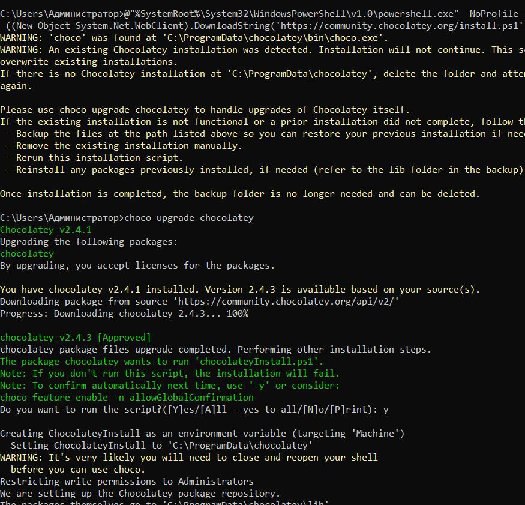
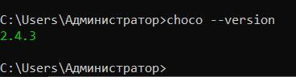
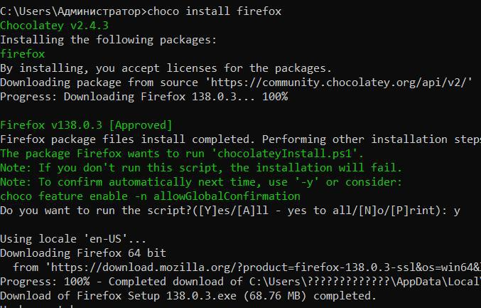
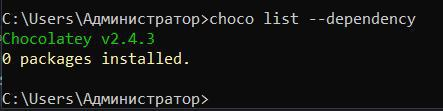
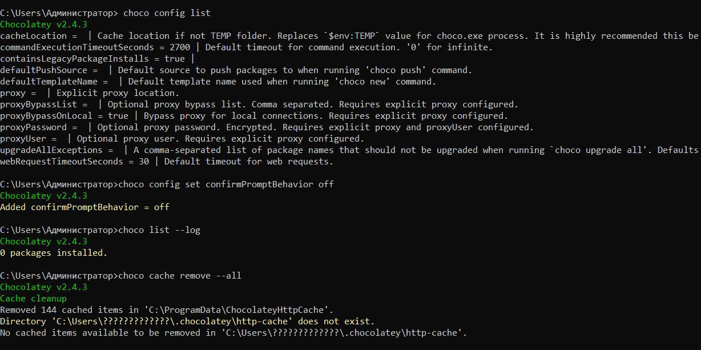
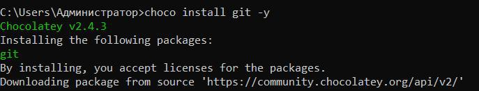

---
## Front matter
lang: ru-RU
title: Презентация по докладу
subtitle: Система управления пакетами Chocolatey
author:
  - Мутале Ч.
institute:
  - Российский университет дружбы народов, Москва, Россия
date: 16 Мая 2025

## i18n babel
babel-lang: russian
babel-otherlangs: english

## Formatting pdf
toc: false
toc-title: Содержание
slide_level: 2
aspectratio: 169
section-titles: true
theme: metropolis
header-includes:
 - \metroset{progressbar=frametitle,sectionpage=progressbar,numbering=fraction}
 - '\makeatletter'
 - '\beamer@ignorenonframefalse'
 - '\makeatother'
---

# Информация

## Докладчик

:::::::::::::: {.columns align=center}
::: {.column width="70%"}

  * Мутале Чали
  * Студент НКА 05-24
  * факультет физико-математичесих 
  * Российский университет дружбы народов
  * [1032239667@rudn.ru](mailto:1032239667@rudn.ru)
  * <https://cmutale-skept.github.io/ru/>

:::
::: {.column width="30%"}
:::
::::::::::::::

# Вводная часть

## Цели работы

Изучить основы работы с Chocolatey — менеджером пакетов для Windows,
предназначенным для упрощения установки, обновления и управления программным
обеспечением. Научиться использовать Chocolatey для автоматизации задач
администрирования.

## Задание

1.Установить Chocolatey на систему Windows.
2.Изучить основные команды Chocolatey для управления пакетами.
3.Написать команд для работы с Chocolatey в среде Bash.
4.Создать командный файл для автоматизации установки программного обеспечения с
помощью Chocolatey.

# Выполнение лабораторной работы

## Установка Chocolatey

•Важно запускать установку от имени администратора. Команда в PowerShell меняет политику
выполнения и загружает скрипт с официального сайта.
•После установки проверьте версию через choco --version. Например, в нашем случае это
2.4.3.

{#fig:001 width=50%}

{#fig:003 width=20%}

## Основные команды Chocolatey

Сначала я написал команду choco install firefox –y, где install — базовая команда. Флаг -y
автоматически подтверждает действия, что критично для скриптов.

{#fig:004 width=50%}

Далее напис ал команду choco list --dependence, которую показывает только
установленные пакеты, а не все доступные.

{#fig:008 width=50%}

{#fig:005 width=50%}

## Проверка работы команд:

Проверка работы команд:

{#fig:009 width=50%}

Установка пакета из конкретного источника (например, vlc из Chocolatey
Community Repository):

{#fig:009 width=50%}

# ВЫвод

Chocolatey превращает управление ПО в Windows из рутинной задачи в эффективный
автоматизированный процесс, сравнимый по удобству с apt в
Linux-системах. Это важно инструмент в арсенале любого человек, работающего с Windows-
инфраструктурой.

