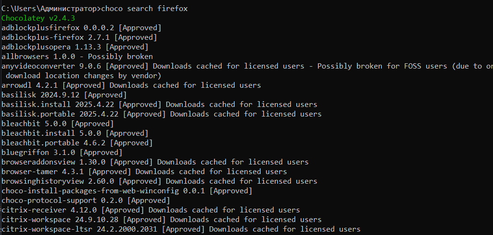
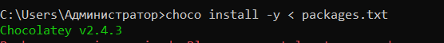

---
## Front matter
title: "Отчёт по докладу"
subtitle: "Система управления пакетами Chocolatey."
author: "Мутале Чали"

## Generic otions
lang: ru-RU
toc-title: "Содержание"

## Bibliography
bibliography: bib/cite.bib
csl: pandoc/csl/gost-r-7-0-5-2008-numeric.csl

## Pdf output format
toc: true # Table of contents
toc-depth: 2
lof: true # List of figures
lot: true # List of tables
fontsize: 12pt
linestretch: 1.5
papersize: a4
documentclass: scrreprt
## I18n polyglossia
polyglossia-lang:
  name: russian
  options:
	- spelling=modern
	- babelshorthands=true
polyglossia-otherlangs:
  name: english
## I18n babel
babel-lang: russian
babel-otherlangs: english
## Fonts
mainfont: PT Serif
romanfont: PT Serif
sansfont: PT Sans
monofont: PT Mono
mainfontoptions: Ligatures=TeX
romanfontoptions: Ligatures=TeX
sansfontoptions: Ligatures=TeX,Scale=MatchLowercase
monofontoptions: Scale=MatchLowercase,Scale=0.9
## Biblatex
biblatex: true
biblio-style: "gost-numeric"
biblatexoptions:
  - parentracker=true
  - backend=biber
  - hyperref=auto
  - language=auto
  - autolang=other*
  - citestyle=gost-numeric
## Pandoc-crossref LaTeX customization
figureTitle: "Рис."
tableTitle: "Таблица"
listingTitle: "Листинг"
lofTitle: "Список иллюстраций"
lotTitle: "Список таблиц"
lolTitle: "Листинги"
## Misc options
indent: true
header-includes:
  - \usepackage{indentfirst}
  - \usepackage{float} # keep figures where there are in the text
  - \floatplacement{figure}{H} # keep figures where there are in the text
---

# Цель работы

Изучить основы работы с Chocolatey — менеджером пакетов для Windows, предназначенным для упрощения установки, обновления и управления программным обеспечением. Научиться использовать Chocolatey для автоматизации задач администрирования.

# Задание

1. Установить Chocolatey на систему Windows.
2. Изучить основные команды Chocolatey для управления пакетами.
3. Написать команд для работы с Chocolatey в среде Bash.
4. Создать командный файл для автоматизации установки программного обеспечения с помощью Chocolatey.

# Выполнение лабораторной работы

##  Установка Chocolatey

Для установки Chocolatey используется следующая команда в PowerShell (администратор):

{#fig:001 width=70%}

После установки проверяем версию Chocolatey:

{#fig:002 width=70%}

## Основные команды Chocolatey

Chocolatey предоставляет широкий набор команд для управления пакетами в Windows. Основные команды включают установку (install), обновление (upgrade), удаление (uninstall), поиск (search) и просмотр списка пакетов (list). Дополнительные команды позволяют настраивать источники пакетов, управлять зависимостями, автоматизировать обновления и восстанавливать поврежденные пакеты. Эти инструменты делают Chocolatey мощным средством для автоматизации управления программным обеспечением в системе.

{#fig:004 width=70%}

{#fig:004 width=70%}

Далее создал командный файл, который анализирует состояние пакетов через команду choco outdated и, используя код возврата $?, автоматически запускает их обновление через choco upgrade all -y, если найдены устаревшие версии.

{#fig:005 width=70%}

Создал скрипт, который через choco search ищет указанный пакет, а затем, проверяя $?, выводит либо список найденных совпадений (код 0), либо сообщение "Пакет не найден" (код 1). Для установленных пакетов дополнительно вызывает choco info для отображения подробностей.

{#fig:006 width=70%}

{#fig:006 width=70%}

{#fig:006 width=70%}

{#fig:006 width=70%}

Написал командный файл, который активирует автообновления (autoUpgrade) и глобальные подтверждения (allowGlobalConfirmation), а затем через анализ $? выводит отчет: "Настройки применены" (0) или "Ошибка конфигурации" (1).

{#fig:006 width=70%}

Реализовал скрипт.

{#fig:006 width=70%}

## Создание командного файла для автоматизации

Создаем файл install_apps.sh для автоматической установки списка программ:

{#fig:007 width=70%}

Добавление нового источника пакетов:

{#fig:008 width=70%}

## Удаление установленного ПО и очистка системы

Для полного удаления программ, установленных через Chocolatey, и очистки системы выполните следующие действия:

{#fig:009 width=70%}

## Проверка работы команд

Все команды были проверены на практике. Например, для установки пакета git использовалась команда:

{#fig:0010 width=70%}

# Выводы

В ходе выполнения работы я изучил основы работы с Chocolatey, научился использовать основные команды для управления пакетами и создал командный файл для автоматизации установки программного обеспечения. Chocolatey значительно упрощает процесс управления ПО в среде Windows, позволяя автоматизировать рутинные задачи.

# Ответы на контрольные вопросы

1. Что такое Chocolatey?
Chocolatey — это менеджер пакетов для Windows, аналогичный apt-get в Linux. Он позволяет упростить установку, обновление и удаление программ.

2. Как установить Chocolatey?
Chocolatey устанавливается через PowerShell с помощью команды, приведенной в разделе 3.1.

3. Какие основные команды используются в Chocolatey?
Основные команды включают install, upgrade, uninstall, search, list и другие.

4. Как обновить все установленные пакеты?
Для обновления всех пакетов используется команда choco upgrade all -y.

5. Как запретить обновление пакета?
Для этого используется команда choco pin add -n=<package_name>.

6. Как экспортировать список установленных пакетов?
Список можно экспортировать с помощью команды choco list --local-only > packages.txt.

7. Как установить пакет из конкретного источника?
Для этого используется флаг --source, например: choco install <package_name> --source=<source_url> -y.

8. Как включить автоматическое обновление?
Автоматическое обновление включается командой choco feature enable -n autoUpgrade.

9. Как проверить наличие обновлений?
Для проверки используется команда choco outdated.

10. Как восстановить поврежденный пакет?
Для восстановления используется команда choco install <package_name> --force -y.

# Список литературы{.unnumbered}

1. [Официальная документация Chocolatey](https://docs.chocolatey.org/)
2. [Руководство по установке Chocolatey](https://community.chocolatey.org/install)
3. [Примеры использования Chocolatey](https://chocolatey.org/docs/commands-reference)
