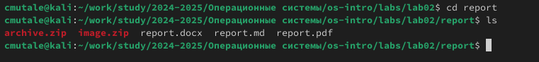
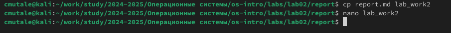
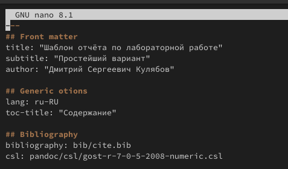

---
## Front matter
lang: ru-RU
title: Презентация по лабораторной работе №3
subtitle: Архитектура компьютеров и операционные системы
author:
  -Мутале Чали.
institute:
  - Российский университет дружбы народов, Москва, Россия
date: 06 Марта 2025

## i18n babel
babel-lang: russian
babel-otherlangs: english

## Formatting pdf
toc: false
toc-title: Содержание
slide_level: 2
aspectratio: 169
section-titles: true
theme: metropolis
header-includes:
 - \metroset{progressbar=frametitle,sectionpage=progressbar,numbering=fraction}
 - '\makeatletter'
 - '\beamer@ignorenonframefalse'
 - '\makeatother'
---

# Цель работы

- Максимально упростить подготовку отчётов по лабораторным работам и познакомиться с основными возможностями разметки Markdown.

# Задание

- Готовить отчёт по лабораторной работе №2

# Выполнение лабораторной работы

## Готовка отчёта по лабораторной работе №2

- Открываю терминал и перехожу в каталог lab02/report:

{#fig:001 width=70%}

Рис. 1:каталог lab03/report

## Готовка отчёта по лабораторной работе №2

- Копирую файл report.md с новым названием LabWork2.

{#fig:002 width=70%}

Рис. 2: Копирование файла

## Готовка отчёта по лабораторной работе №2

- Затем я редактирую файл LabWork2 с помощью gedit:

{#fig:003 width=70%}

Рис. 3: Редатирование

## Готовка отчёта по лабораторной работе №2

- Копирую файл LabWork2 в файл LabWork2.md и с помощью командой make создаю LabWork2.docx и LabWork2.pdf:

{#fig:004 width=70%}

Рис. 4: Создание LabWork2.docx и LabWork2.pdf

# Выводы

При выполнение данной работы я познакомилась с основными возможностями разметки Markdown.

