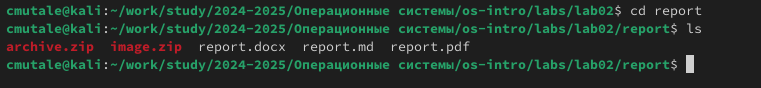
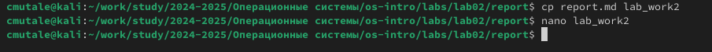
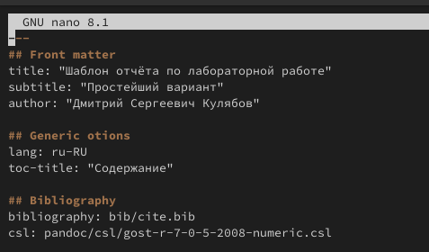

---
## Front matter
title: "Отчёт по лабораторной работе №3"
subtitle: "Простейший вариант"
author: "Мутале Чали"

## Generic options
lang: ru-RU
toc-title: "Содержание"

## Bibliography
bibliography: bib/cite.bib
csl: pandoc/csl/gost-r-7-8-5-2008-numeric.csl

## pdf output format
toc-depth: 2
lof: true # list of figures
lot: true # list of tables
fontsize: 12pt
linestretch: 1.5
papersize: a4
documentclass: scrreprt
## I18n polyglossia
polyglossia-lang:
        name: russian
        options:
                - spelling=modern
                - babelshorthands=true
polyglossia-otherlangs:
        name: english
## I18n babel
babel-lang: russian
babel-otherlangs: english
## Fonts
mainfont: PT Serif
romanfont: PT Serif
sansfont: PT Sans
monofont: PT Mono
mainfontoptions: Ligatures=TeX
romanfontoptions: Ligatures=TeX
sansfontoptions: Ligatures=TeX,Scale=MatchLowercase
monofontoptions: Scale=MatchLowercase,Scale=0.9
## Biblatex
biblatex: true
biblio-style: "gost-numeric"
biblatexoptions:
  - parentracker=true
  - backend=biber
  - hyperref=auto
  - language=auto
  - autolang=other*
  - citestyle=gost-numeric
## Pandoc-crossref LaTeX customization
figureTitle: "Рис."
tableTitle: "Таблица"
listingTitle: "Листинг"
lofTitle: "Список иллюстраций"
lotTitle: "Список таблиц"
lolTitle: "Листинги"
## Misc options
indent: true
header-includes:
  - \usepackage{indentfirst}
  - \usepackage{float} # keep figures where there are in the text
  - \floatplacement{figure}{H} # keep figures where there are in the text
---

# Цель работы

Научиться оформлять отчёты с помощью легковесного языка разметки Markdown.

# Задание

- Готовить отчёт по лабораторной работе №2

# Выполнение лабораторной работы

## Готовка отчёта по лабораторной работе №2

Сначала открываю терминал и перехожу в каталог lab02/report:

{#fig:001 width=70%}

Рис. 1: каталог lab03/report

Далее копирую файл report.md с новым названием Lab_work2. Затем я редактирую файл Lab_work2 с помощью nano:

{#fig:002 width=70%}

Рис. 2: Копирование файла

{#fig:003 width=70%}

Рис. 3: Редатирование

Копирую файл LabWork2 в файл LabWork2.md и с помощью командой pandoc создаю LabWork2.docx и LabWork2.pdf:

{#fig:004 width=70%}

Рис. 4: Создание LabWork2.docx и LabWork2.pdf

# Выводы

При выполнение данной работы я познакомилась с основными возможностями разметки Markdown.

# Список литературы{.unnumbered}

[Архитектура ЭВМ]{}
