---
## Front matter
lang: ru-RU
title: Презентация по лабораторной работе №7
subtitle: Анализ файловой системы Linux. Команды для работы с файлами и каталогами
author:
  - Мутале Ч.
institute:
  - Российский университет дружбы народов, Москва, Россия
date: 24 марта 2025

## i18n babel
babel-lang: russian
babel-otherlangs: english

## Formatting pdf
toc: false
toc-title: Содержание
slide_level: 2
aspectratio: 169
section-titles: true
theme: metropolis
header-includes:
 - \metroset{progressbar=frametitle,sectionpage=progressbar,numbering=fraction}
 - '\makeatletter'
 - '\beamer@ignorenonframefalse'
 - '\makeatother'
---

# Информация

## Докладчик

:::::::::::::: {.columns align=center}
::: {.column width="70%"}

  * Мутале Чали
  * НКАбд 05-24
  * Факультет физико-математический и естественных наук
  * Российский университет дружбы народов
  * [1032239667@rudn.ru](1032239667@rudn.ru)
  * <https://cmutale-skept.github.io/>

:::
::: {.column width="30%"}
:::
::::::::::::::

## Работа с файлами и каталогами

Создаю файл abc1 с помощью touch и копирую его с новыми именами april и may исползуя cp:

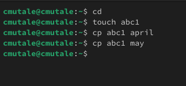{#fig:001 width=70%}

## Работа с файлами и каталогами

Создаю каталог monthly и копирую april и may в нем исползуя cp. Проверяю с ls:

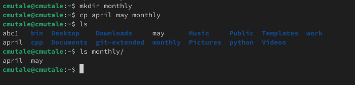{#fig:002 width=70%}

## Работа с файлами и каталогами

Копирую каталог monthly в каталог monthly.00 с помощью опции cp -r:

{#fig:004 width=70%}

## Работа с файлами и каталогами

Изменяю название файла april на july в домашнем каталоге и перемещаю файл july в каталог monthly.00:

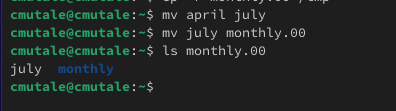{#fig:006 width=70%}

## Работа с файлами и каталогами

 Перемещаю файл equipment в каталог ~/ski.plases:

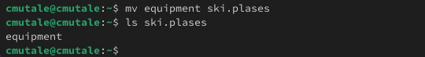{#fig:0011 width=70%}

## Работа с файлами и каталогами

Переименую файл ~/ski.plases/equipment в ~/ski.plases/equiplist и копирую abc1 в каталог ~/ski.plases, назову его equiplist2:

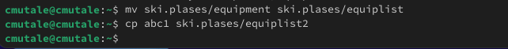{#fig:0012 width=70%}

## Работа с файлами и каталогами

Создаю каталог с именем equipment в каталоге ~/ski.plases и перемещаю файлы ~/ski.plases/equiplist и equiplist2 в каталог ~/ski.plases/equipment:

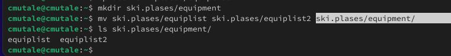{#fig:0013 width=70%}

## Работа с файлами и каталогами

Создаю каталог australia. Удаляю права на исполнение для группы (g-x) и владелца(u-x):

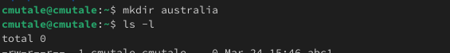{#fig:0015 width=70%}

## Работа с файлами и каталогами

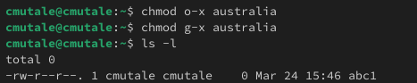{#fig:0016 width=70%}

## Работа с файлами и каталогами

Изменяю права доступа к каталогу play и проверяю:

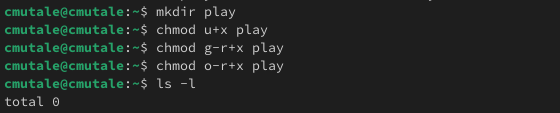{#fig:0017 width=70%}

## Работа с файлами и каталогами

{#fig:0018 width=70%}

## Работа с файлами и каталогами

Изменяю права доступа к файлу feathers и проверяю:

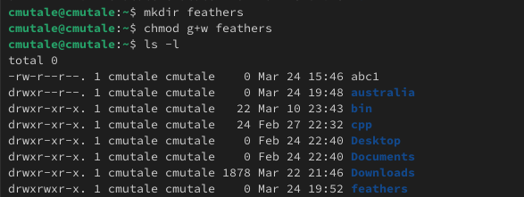{#fig:0019 width=70%}

## Работа с файлами и каталогами

Смотрю содержимое файла /etc/passwd:

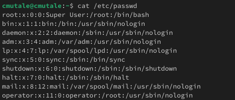{#fig:0020 width=70%}

## Работа с файлами и каталогами

Лишаю пользователя файла ~/feathers права на чтение:

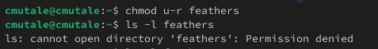{#fig:0023 width=70%}

## Работа с файлами и каталогами

Когда я попытаюсь просмотреть файл ~/feathers командой cat, система запрешает мне:

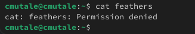{#fig:0024 width=70%}

## Работа с файлами и каталогами

Лишаю владельца каталога ~/play права на выполнение. Когда я попробую перейти в этот же каталог, система запрешает мне:

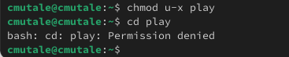{#fig:0025 width=70%}

## Работа с файлами и каталогами

Даю владельцу каталога ~/play право на выполнение:

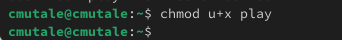{#fig:0026 width=70%}

## Работа с файлами и каталогами

С помощью man прочитаю по mount — утилита командной строки в UNIX-подобных операционных системах. Применяется для монтирования файловых систем.

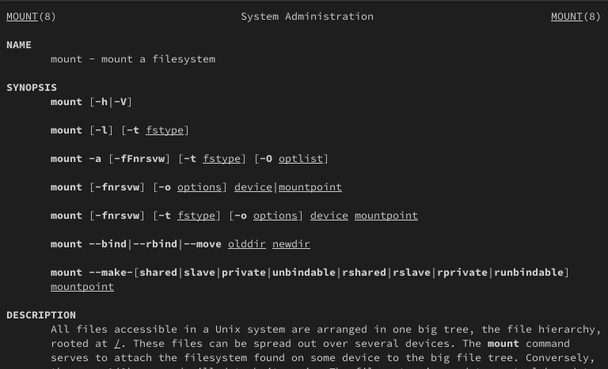{#fig:0027 width=70%}

