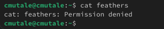
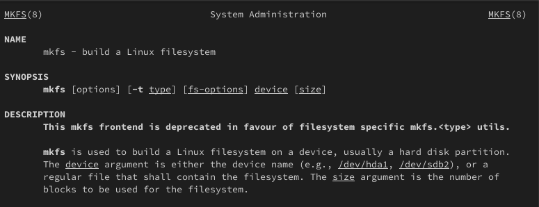

---
## Front matter
title: "Отчёт по лабораторной работе №7"
subtitle: "Анализ файловой системы Linux. Команды для работы с файлами и каталогами"
author: "Мутале Чали"

## Generic otions
lang: ru-RU
toc-title: "Содержание"

## Bibliography
bibliography: bib/cite.bib
csl: pandoc/csl/gost-r-7-0-5-2008-numeric.csl

## Pdf output format
toc: true # Table of contents
toc-depth: 2
lof: true # List of figures
fontsize: 12pt
linestretch: 1.5
papersize: a4
documentclass: scrreprt
## I18n polyglossia
polyglossia-lang:
  name: russian
  options:
	- spelling=modern
	- babelshorthands=true
polyglossia-otherlangs:
  name: english
## I18n babel
babel-lang: russian
babel-otherlangs: english
## Fonts
mainfont: PT Serif
romanfont: PT Serif
sansfont: PT Sans
monofont: PT Mono
mainfontoptions: Ligatures=TeX
romanfontoptions: Ligatures=TeX
sansfontoptions: Ligatures=TeX,Scale=MatchLowercase
monofontoptions: Scale=MatchLowercase,Scale=0.9
## Biblatex
biblatex: true
biblio-style: "gost-numeric"
biblatexoptions:
  - parentracker=true
  - backend=biber
  - hyperref=auto
  - language=auto
  - autolang=other*
  - citestyle=gost-numeric
## Pandoc-crossref LaTeX customization
figureTitle: "Рис."
listingTitle: "Листинг"
lofTitle: "Список иллюстраций"
lolTitle: "Листинги"
## Misc options
indent: true
header-includes:
  - \usepackage{indentfirst}
  - \usepackage{float} # keep figures where there are in the text
  - \floatplacement{figure}{H} # keep figures where there are in the text
---

# Цель работы

Ознакомление с файловой системой Linux, её структурой, именами и содержанием каталогов. Приобретение практических навыков по применению команд для работы с файлами и каталогами, по управлению процессами (и работами), по проверке использования диска и обслуживанию файловой системы.

# Задание

1. Команды для работы с файлами и каталогами
2. Анализ файловой системы Linux.

# Выполнение лабораторной работы

## Команды для работы с файлами и каталогами

Создаю файл abc1 с помощью touch и копирую его с новыми именами april и may исползуя cp:

{#fig:001 width=70%}

Создаю каталог monthly и копирую april и may в нем исползуя cp. Проверяю с ls:

{#fig:002 width=70%}

В каталоге monthly копирую файл may с именем june исползуя cp:

{#fig:003 width=70%}

Копирую каталог monthly в каталог monthly.00 с помощью опции cp -r:

{#fig:004 width=70%}

Копирую каталог monthly.00 в каталог /tmp:

{#fig:005 width=70%}

Изменяю название файла april на july в домашнем каталоге и перемещаю файл july в каталог monthly.00:

{#fig:006 width=70%}

Переименовываю каталог monthly.00 в monthly.01. Перемещаю каталог monthly.01 в каталог reports:

{#fig:007 width=70%}

Переименовываю каталог reports/monthly.01 в reports/monthly:

{#fig:008 width=70%}

Копирую файл /usr/include/sys/io.h в домашний каталог и назову его equipment:

{#fig:009 width=70%}

В домашнем каталоге создаю директорию ~/ski.plases с помощью mkdir:

{#fig:0010 width=70%}

 Перемещаю файл equipment в каталог ~/ski.plases:

{#fig:0011 width=70%}

Переименую файл ~/ski.plases/equipment в ~/ski.plases/equiplist и копирую abc1 в каталог ~/ski.plases, назову его equiplist2:

{#fig:0012 width=70%}

Создаю каталог с именем equipment в каталоге ~/ski.plases и перемещаю файлы ~/ski.plases/equiplist и equiplist2 в каталог ~/ski.plases/equipment:

{#fig:0013 width=70%}

Создаю и перемещаю каталог ~/newdir в каталог ~/ski.plases и назову его plans:

{#fig:0014 width=70%}

Создаю каталог australia. Удаляю права на исполнение для группы (g-x) и владелца(u-x):

{#fig:0015 width=70%}

{#fig:0016 width=70%}

Изменяю права доступа к каталогу play и проверяю:

{#fig:0017 width=70%}

{#fig:0018 width=70%}

Изменяю права доступа к файлу feathers и проверяю:

{#fig:0019 width=70%}

 Смотрю содержимое файла /etc/passwd:

{#fig:0020 width=70%}

Копирую файл ~/feathers в файл ~/file.old, перемещаю файл ~/file.old в каталог ~/play и копирую каталог ~/play в каталог ~/fun:

{#fig:0021 width=70%}

Перемещаю каталог ~/fun в каталог ~/play и назову его games:

{#fig:0022 width=70%}

Лишаю пользователя файла ~/feathers права на чтение:

{#fig:0023 width=70%}

Когда я попытаюсь просмотреть файл ~/feathers командой cat, система запрешает мне:

{#fig:0024 width=70%}

Лишаю владельца каталога ~/play права на выполнение. Когда я попробую перейти в этот же каталог, система запрешает мне:

{#fig:0025 width=70%}

Даю владельцу каталога ~/play право на выполнение:

{#fig:0026 width=70%}

С помощью man прочитаю по следующим командам:
mount — утилита командной строки в UNIX-подобных операционных системах. Применяется для монтирования файловых систем.

{#fig:0027 width=70%}

fsck (проверка файловой системы) - это утилита командной строки, которая позволяет выполнять проверки согласованности и интерактивное исправление в одной или нескольких файловых системах Linux. Он использует программы, специфичные для типа файловой системы, которую он проверяет.

{#fig:0028 width=70%}

mkfs используется для создания файловой системы Linux на некотором устройстве, обычно в разделе жёсткого диска. В качестве аргумента filesys для файловой системы может выступать или название устройства

{#fig:0029 width=70%}

Команда Kill посылает указанный сигнал указанному процессу. Если не указано ни одного сигнала, посылается сигнал SIGTERM. Сигнал SIGTERM завершает лишь те процессы, которые не обрабатывают его приход. Для других процессов может быть необходимым послать сигнал SIGKILL, поскольку этот сигнал перехватить невозможно.

{#fig:0030 width=70%}

# Выводы

При выполнении данной лабораторной работы я ознакомилась с файловой системой Linux, её структурой, именами и содержанием каталогов. Приобрела практические навыки по применению команд для работы с файлами и каталогами, по управлению процессами (и работами), по проверке использования диска и обслуживанию файловой системы.

## Ответы на контрольные вопросы

1. Ext2, Ext3, Ext4 или Extended Filesystem - это стандартная файловая система для Linux. Она была разработана еще для Minix. Она самая стабильная из всех существующих, кодовая база изменяется очень редко и эта файловая система содержит больше всего функций. Версия ext2 была разработана уже именно для Linux и получила много улучшений. В 2001 году вышла ext3, которая добавила еще больше стабильности благодаря использованию журналирования. В 2006 была выпущена версия ext4, которая используется во всех дистрибутивах Linux до сегодняшнего дня. В ней было внесено много улучшений, в том числе увеличен максимальный размер раздела до одного экзабайта.

Btrfs или B-Tree File System - это совершенно новая файловая система, которая сосредоточена на отказоустойчивости, легкости администрирования и восстановления данных. Файловая система объединяет в себе очень много новых интересных возможностей, таких как размещение на нескольких разделах, поддержка подтомов, изменение размера не лету, создание мгновенных снимков, а также высокая производительность. Но многими пользователями файловая система Btrfs считается нестабильной. Тем не менее, она уже используется как файловая система по умолчанию в OpenSUSE и SUSE Linux.

2. / — root каталог. Содержит в себе всю иерархию системы;

/bin — здесь находятся двоичные исполняемые файлы. Основные общие команды, хранящиеся отдельно от других программ в системе (прим.: pwd, ls, cat, ps);

/boot — тут расположены файлы, используемые для загрузки системы (образ initrd, ядро vmlinuz);

/dev — в данной директории располагаются файлы устройств (драйверов). С помощью этих файлов можно взаимодействовать с устройствами. К примеру, если это жесткий диск, можно подключить его к файловой системе. В файл принтера же можно написать напрямую и отправить задание на печать;

/etc — в этой директории находятся файлы конфигураций программ. Эти файлы позволяют настраивать системы, сервисы, скрипты системных демонов;

/home — каталог, аналогичный каталогу Users в Windows. Содержит домашние каталоги учетных записей пользователей (кроме root). При создании нового пользователя здесь создается одноименный каталог с аналогичным именем и хранит личные файлы этого пользователя;

/lib — содержит системные библиотеки, с которыми работают программы и модули ядра;

/lost+found — содержит файлы, восстановленные после сбоя работы системы. Система проведет проверку после сбоя и найденные файлы можно будет посмотреть в данном каталоге;

/media — точка монтирования внешних носителей. Например, когда вы вставляете диск в дисковод, он будет автоматически смонтирован в директорию /media/cdrom;

/mnt — точка временного монтирования. Файловые системы подключаемых устройств обычно монтируются в этот каталог для временного использования;

/opt — тут расположены дополнительные (необязательные) приложения. Такие программы обычно не подчиняются принятой иерархии и хранят свои файлы в одном подкаталоге (бинарные, библиотеки, конфигурации);

/proc — содержит файлы, хранящие информацию о запущенных процессах и о состоянии ядра ОС;

/root — директория, которая содержит файлы и личные настройки суперпользователя;

/run — содержит файлы состояния приложений. Например, PID-файлы или UNIX-сокеты;

/sbin — аналогично /bin содержит бинарные файлы. Утилиты нужны для настройки и администрирования системы суперпользователем;

/srv — содержит файлы сервисов, предоставляемых сервером (прим. FTP или Apache HTTP);

/sys — содержит данные непосредственно о системе. Тут можно узнать информацию о ядре, драйверах и устройствах;

/tmp — содержит временные файлы. Данные файлы доступны всем пользователям на чтение и запись. Стоит отметить, что данный каталог очищается при перезагрузке;

/usr — содержит пользовательские приложения и утилиты второго уровня, используемые пользователями, а

не системой. Содержимое доступно только для чтения (кроме root). Каталог имеет вторичную иерархию и похож на корневой;

/var — содержит переменные файлы. Имеет подкаталоги, отвечающие за отдельные переменные. Например, логи будут храниться в /var/log, кэш в /var/cache, очереди заданий в /var/spool/ и так далее.

3. Монтирование тома.

4. Один блок адресуется несколькими mode (принадлежит нескольким файлам). Блок помечен как свободный, но в то же время занят (на него ссылается onode). Блок помечен как занятый, но в то же время свободен (ни один inode на него не ссылается). Неправильное число ссылок в inode (недостаток или избыток ссылающихся записей в каталогах). Несовпадение между размером файла и суммарным размером адресуемых inode блоков. Недопустимые адресуемые блоки (например, расположенные за пределами файловой системы). "Потерянные" файлы (правильные inode, на которые не ссылаются записи каталогов). Недопустимые или неразмещенные номера inode в записях каталогов.

5. mkfs - позволяет создать файловую систему Linux.

6.  Cat - выводит содержимое файла на стандартное устройство вывода. Выполнение команды head выведет первые 10 строк текстового файла. Выполнение команды tail выведет последние 10 строк текстового файла. Команда tac - это тоже самое, что и cat, только отображает строки в обратном порядке. Для того, чтобы просмотреть огромный текстовый файл применяются команды для постраничного просмотра. Такие как more и less.

7. Cp – копирует или перемещает директорию, файлы.

8. Mv - переименовать или переместить файл или директорию

9. Права доступа к файлу или каталогу можно изменить, воспользовавшись командой chmod. Сделать это может владелец файла (или каталога) или пользователь с правами администратора.
