---
## Front matter
lang: ru-RU
title: Презентация по лабораторной работе №9
subtitle: Командная оболочка Midnight Commander
author:
  - Мутале ч.
institute:
  - Российский университет дружбы народов, Москва, Россия
date: 11 Апреля 2025

## i18n babel
babel-lang: russian
babel-otherlangs: english

## Formatting pdf
toc: false
toc-title: Содержание
slide_level: 2
aspectratio: 169
section-titles: true
theme: metropolis
header-includes:
 - \metroset{progressbar=frametitle,sectionpage=progressbar,numbering=fraction}
 - '\makeatletter'
 - '\beamer@ignorenonframefalse'
 - '\makeatother'
---

# Информация

## Докладчик

:::::::::::::: {.columns align=center}
::: {.column width="60%"}

  * Мутале Чали
  * Студентка НКА 05-24
  * Факультет физико-математических и естественных наук
  * Российский университет дружбы народов
  * [1032239667@rudn.ru](mailto:1032239667@rudn.ru)
  * <https://cmutale-skept.github.io/ru/>

:::
::: {.column width="30%"}
:::
::::::::::::::

# Задание по mc

Я запускал mc, изучал его структуру и меню:

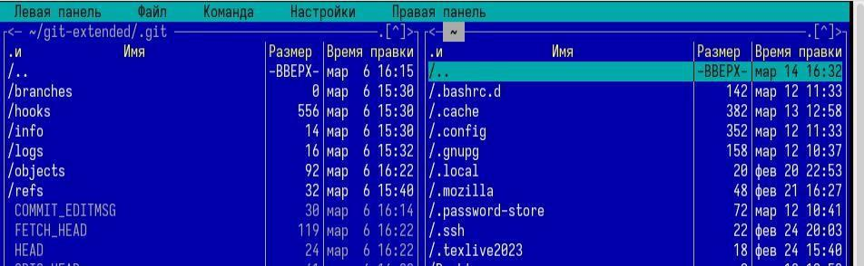{#fig:002 width=60%}

## Задание по mc

 Используя управляющие клавиши я; скопировал файл README.md в домашний каталог:

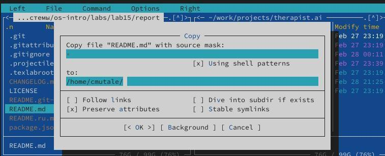{#fig:003 width=60%}

## Задание по mc

Создал файл new в ~/work/blog и удалила его: 

{#fig:004 width=60%}

## Задание по mc

{#fig:005 width=60%}

## Задание по mc

Получил информацию о размере и правах доступа на файл README.md:

{#fig:006 width=60%}

## Задание по mc

В правой панели вывел информацию о файле. При этом я получаю больше информации чем в выводе ls:

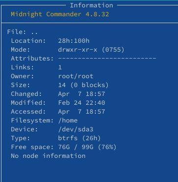{#fig:007 width=60%}

## Задание по mc

Используя возможности подменю Файл; я посмотрел содержаемые текстового файла:

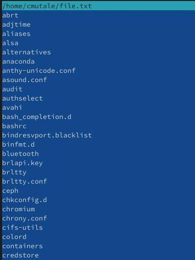{#fig:008 width=60%}

## Задание по mc

редактировал содержаемые текстового файла (abrt на mi): 

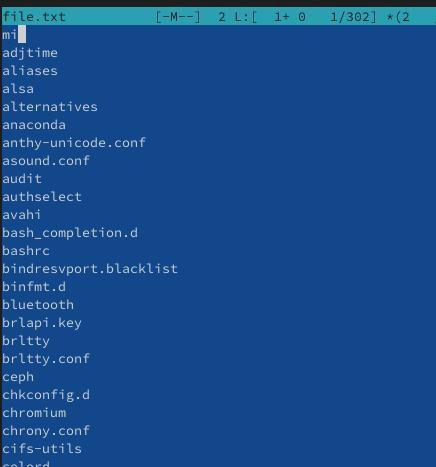{#fig:009 width=60%}

## Задание по mc

Создал новый каталог:

{#fig:0010 width=60%}

## Задание по mc

и скопировал файл в ,только что созданный каталог:

{#fig:0011 width=60%}

## Задание по mc

С помощью подменю команда можно найти в файловой системе файл с заданными условиями:

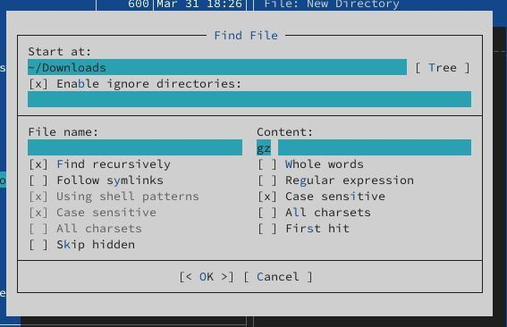{#fig:0012 width=60%}

## Задание по mc

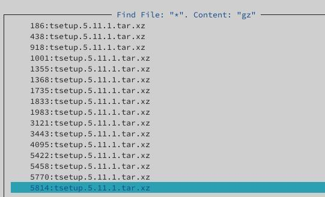{#fig:0013 width=60%}

## Задание по mc

Исользуя подменю команда я повторил одну из предыдущих команд:

{#fig:0014 width=60%}

## Задание по mc

Также перешёл в домашний каталог и анализировал файл меню и файл расширения:

{#fig:0015 width=60%}

## Задание по mc

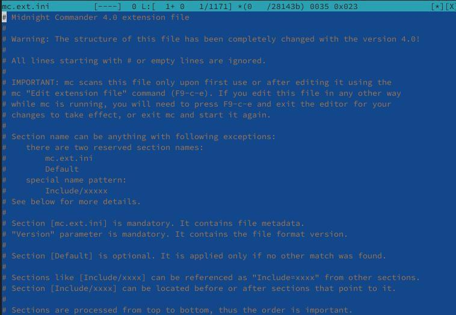{#fig:0016 width=60%}

## Задание по mc

Из подменю настройка вызвал окна настройки панели:

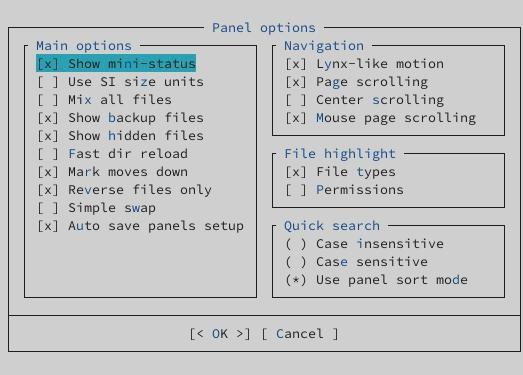{#fig:0017 width=60%}

## Задание по mc

Настройки внешнего вида:

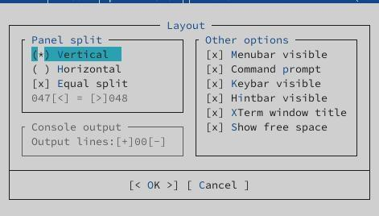{#fig:0018 width=60%}

# Задание по встроенному редактору mc

С помощью команды touch создал text.txt:

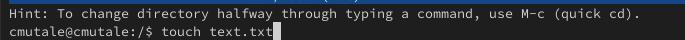{#fig:0019 width=60%}

## Задание по встроенному редактору mc

Далее открыл его для редактирования с помощью f4 и с shift ctrl ins вставил текст:

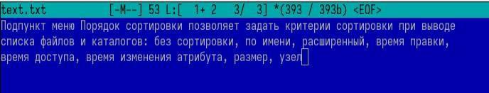{#fig:0020 width=60%}

## Задание по встроенному редактору mc

С помощью f3 выделил текст и удалил выделеные слова f8:

{#fig:0021 width=60%}

## Задание по встроенному редактору mc

Перемещал выделенный текст с помощью f6:

{#fig:0022 width=60%}

## Задание по встроенному редактору mc

Сохранил изменении с помощью f2:

{#fig:0023 width=60%}

## Задание по встроенному редактору mc

С помощью ctrl-u отменила последнее действие:

{#fig:0024 width=60%}

## Задание по встроенному редактору mc

Используя pg up и pg dn перешёл в начало и конец файла и написал некоторый текст. Затем сохранил и закрыл файл:

{#fig:0025 width=60%}

## Задание по встроенному редактору mc

Открыл файл с исходным текстом на cpp:

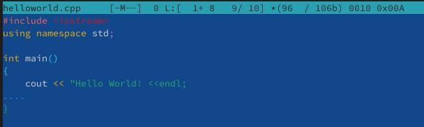{#fig:0026 width=60%}

## Задание по встроенному редактору mc

Используя подменю команда я выключила подсветку синтаксиса:

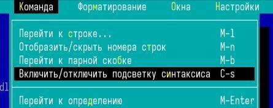{#fig:0027 width=60%}

## Задание по встроенному редактору mc

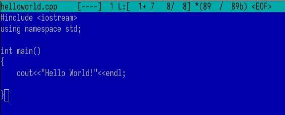{#fig:0028 width=60%}

