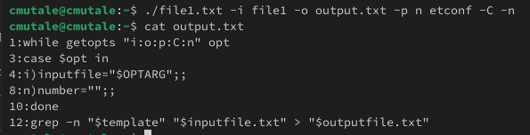
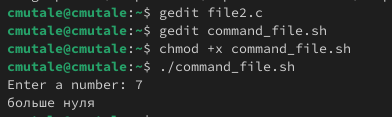

---
## Front matter
lang: ru-RU
title: Презентация по лабораторной работе №13
subtitle: Программирование в командном процессоре ОС UNIX. Ветвления и циклы
author:
  - Мутале Ч.
institute:
  - Российский университет дружбы народов, Москва, Россия
date: 10 Мая 2025

## i18n babel
babel-lang: russian
babel-otherlangs: english

## Formatting pdf
toc: false
toc-title: Содержание
slide_level: 2
aspectratio: 169
section-titles: true
theme: metropolis
header-includes:
 - \metroset{progressbar=frametitle,sectionpage=progressbar,numbering=fraction}
 - '\makeatletter'
 - '\beamer@ignorenonframefalse'
 - '\makeatother'
---

# Информация

## Докладчик

:::::::::::::: {.columns align=center}
::: {.column width="70%"}

  * Мутале Чали
  * НКА 05-24
  * факультет физико математических  и естественных наук
  * Российский университет дружбы народов
  * [1032239667@rudn.ru](mailto:1032239667@rudn.ru)
  * <https://cmutale.github.io/ru/>

:::
:::
::::::::::::::

# Цель работы

Изучить основы программирования в оболочке ОС UNIX. Научится писать более сложные командные файлы с использованием логических управляющих конструкций и циклов.

# Задание

1. Используя команды getopts grep, написать командный файл, который анализирует командную строку 
2. Написать на языке Си программу, которая вводит число и определяет, является ли оно больше нуля, меньше нуля или равно нулю.
3. Написать командный файл, создающий указанное число файлов, пронумерованных последовательно от 1 до N
4. Написать командный файл, который с помощью команды tar запаковывает в архив все файлы в указанной директории.

# Выполнение лабораторной работы

## командный файл, который анализирует командную строку 

Создаю файл file1 и в нем написала код, который анализирует командную строку с ключами -i (прочитать данные из указанного файла), -o (вывести данные в указанный файл), -p (указать шаблон для поиска), -C (различать большие и малые буквы), -n (выдавать номера строк) используя команды getopts grep:

## командный файл, который анализирует командную строку 

```
while getopts "i:o:p:C:n" opt
do
case $opt in
i)inputfile="$OPTARG";;
o)outputfile="$OPTARG";;
p)template="$OPTARG";;
c)register="$OPTARG";;
n)number="";;
esac
done

grep -n "$template" "$inputfile.txt" > "$outputfile.txt"

```

## командный файл, который анализирует командную строку 

{#fig:003 width=70%}

## программa, которая вводит число и определяет, является ли оно больше нуля, меньше нуля или равно нулю.

Программа завершается с помощью функции exit(n), передавая информацию о коде завершения в оболочку:

```
#include <stdlib.h>
#include <stdio.h>

int main()
{
	int n;
	printf("Enter a number: ");
	scanf("%d", &n);
	if(n>0)
```

## программa, которая вводит число и определяет, является ли оно больше нуля, меньше нуля или равно нулю.
	
```	
	{
		exit(1);
	}	
	
	else if (n==0) {
		exit(0);}
	else
	{
	exit(2);
	}
}
```

## программa, которая вводит число и определяет, является ли оно больше нуля, меньше нуля или равно нулю.

Далее создал командный файл который вызывает эту программу и, проанализировав с помощью команды $?, выдает сообщение о том, какое число было введено:

```
gcc -o cprog file2.c
./cprog

case $? in
0) echo "равно нулю";;
1) echo "больше нуля";;
2) echo "меньше нуля";;

esac
```

## программa, которая вводит число и определяет, является ли оно больше нуля, меньше нуля или равно нулю.

Создал исполняемый файл и запустил:

{#fig:006 width=70%}

## командный файл, создающий указанное число файлов

Я написал командный файл, создающий указанное число файлов, пронумерованных последовательно от 1 до N. Число файлов, которые необходимо создать, передаётся в аргументы командной строки. Этот же командный файл должен уметь удалять все созданные им файлы (если они существуют):

```
for((i=1; i<=$*; i++))
do
if test -f "$i".tmp
then rm "$i".tmp
else touch "$i.tmp"
fi
done
```

## командный файл, создающий указанное число файлов

Создал исполняемый файл и запустил:

{#fig:008 width=70%}

## командный файл, который с помощью команды tar запаковывает в архив все файлы в указанной директории.

создал командный файл, который с помощью команды tar запаковывает в архив все файлы в указанной директории. Модифицировала его так, чтобы запаковывались только те файлы, которые были изменены менее недели тому назад (использовать
команду find).

```
find $* -mtime -7 -mtime +0 -type f > FILES.txt
tar -cf archive.tar -T FILES.txt
```

## командный файл, который с помощью команды tar запаковывает в архив все файлы в указанной директории.

{#fig:0010 width=70%}


# Выводы

При выполнении проделанной работы я научился писать более сложные командные файлы с использованием логических управляющих конструкций и циклов.
