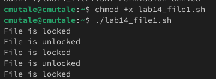
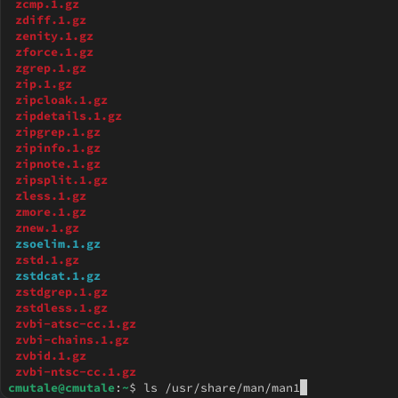
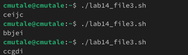

---
## Front matter
lang: ru-RU
title: Презентация по лабораторной работе №14
subtitle: Программирование в командном процессоре ОС UNIX. Расширенное программирование
author:
  - Мутале Ч.
institute:
  - Российский университет дружбы народов, Москва, Россия
date: 17 мая 2025

## i18n babel
babel-lang: russian
babel-otherlangs: english

## Formatting pdf
toc: false
toc-title: Содержание
slide_level: 2
aspectratio: 169
section-titles: true
theme: metropolis
header-includes:
 - \metroset{progressbar=frametitle,sectionpage=progressbar,numbering=fraction}
 - '\makeatletter'
 - '\beamer@ignorenonframefalse'
 - '\makeatother'
---

# Информация

## Докладчик

:::::::::::::: {.columns align=center}
::: {.column width="70%"}

  * Вакутайпа Милдред
  * НКА 05-24
  * Факультет физико математических и естесвенных наук
  * Российский университет дружбы народов
  * [1032239667@rudn.ru](mailto:1032239667@rudn.ru)
  * <https://cmutale-skept.github.io/ru/>

:::
::::::::::::::

# Цель работы

Изучить основы программирования в оболочке ОС UNIX. Научиться писать более сложные командные файлы с использованием логических управляющих конструкций и циклов.

# Задание

1. Написать командный файл, реализующий упрощённый механизм семафоров.
2. Реализовать команду man с помощью командного файла.
3. Используя встроенную переменную $RANDOM, написать командный файл, генерирующий случайную последовательность букв латинского алфавита.

# Выполнение лабораторной работы

## командный файл, реализующий упрощённый механизм семафоров

```
lockfile="./lock.file"
exec {fn}>$lockfile

while test -f "$lockfile"
do
if flock -n ${fn}
then
	echo "File is locked"
```	

## командный файл, реализующий упрощённый механизм семафоров

```	
	sleep 5
	echo "File is unlocked"
	flock -u ${fn}
else
	echo "File is locked"
	sleep 5

fi
done	
```

## командный файл, реализующий упрощённый механизм семафоров

{#fig:002 width=70%}

## Реализовать команду man с помощью командного файла

В /usr/share/man/man1 находятся архивы текстовых файлов, содержащих справку по большинству установленных в системе программ и команд:

{#fig:003 width=70%}

## Реализовать команду man с помощью командного файла

```
a=$1
if test -f "/usr/share/man/man1/$a.1.gz"
then less /usr/share/man/man1/$a.1.gz
else
echo "Invalid command"
fi
```

## Реализовать команду man с помощью командного файла

{#fig:005 width=70%}

## Реализовать команду man с помощью командного файла

{#fig:006 width=70%}

## написать командный файл, генерирующий случайную последовательность букв латинского алфавита.

```
echo $RANDOM | tr '0-9' 'a-zA-Z'
```

{#fig:008 width=70%}

# Выводы

При выполнении данной работы я научилась писать более сложные командные файлы с использованием логических управляющих конструкций и циклов.

