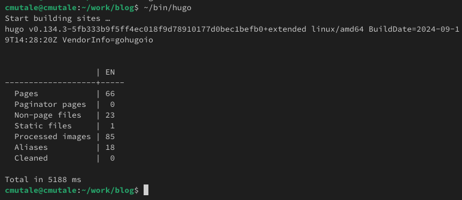
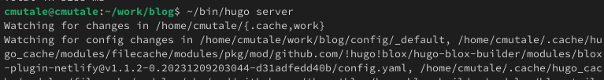
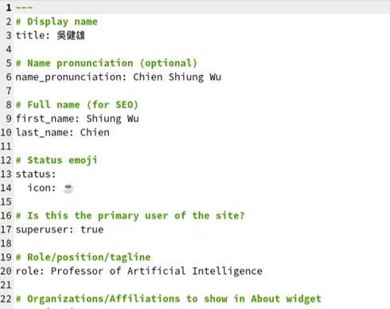
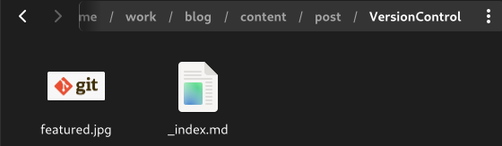

---
## Front matter
title: "Отчёт о выполнении второго этапа индивидуального проекта"
subtitle: "Архитектура компьютеров и операционные системы"
author: "Мутале Чали"

## Generic otions
lang: ru-RU
toc-title: "Содержание"

## Bibliography
bibliography: bib/cite.bib
csl: pandoc/csl/gost-r-7-0-5-2008-numeric.csl

## Pdf output format
toc: true # Table of contents
toc-depth: 2
lof: true # List of figures
fontsize: 12pt
linestretch: 1.5
papersize: a4
documentclass: scrreprt
## I18n polyglossia
polyglossia-lang:
  name: russian
  options:
	- spelling=modern
	- babelshorthands=true
polyglossia-otherlangs:
  name: english
## I18n babel
babel-lang: russian
babel-otherlangs: english
## Fonts
mainfont: PT Serif
romanfont: PT Serif
sansfont: PT Sans
monofont: PT Mono
mainfontoptions: Ligatures=TeX
romanfontoptions: Ligatures=TeX
sansfontoptions: Ligatures=TeX,Scale=MatchLowercase
monofontoptions: Scale=MatchLowercase,Scale=0.9
## Biblatex
biblatex: true
biblio-style: "gost-numeric"
biblatexoptions:
  - parentracker=true
  - backend=biber
  - hyperref=auto
  - language=auto
  - autolang=other*
  - citestyle=gost-numeric
## Pandoc-crossref LaTeX customization
figureTitle: "Рис."
listingTitle: "Листинг"
lofTitle: "Список иллюстраций"
lotTitle: "Список таблиц"
lolTitle: "Листинги"
## Misc options
indent: true
header-includes:
  - \usepackage{indentfirst}
  - \usepackage{float} # keep figures where there are in the text
  - \floatplacement{figure}{H} # keep figures where there are in the text
---

# Цель работы

Изучение размещения посты на сайте.

# Задание

1. Добавлять данные:
   1. Разместить фотографию владельца сайта
   2. Разместить краткое описание владельца сайта
   3. Добавить информацию об интересах
   4. Добавить информацию об образовании
   
2. Сделать пост по прошедшей неделе
3. Сделать пост по теме "Управление версиями GIT" 

# Выполнение лабораторной работы

## Добавление данных

### Разместить фотографию владельца сайта

Я запускаю hugo в каталоге ~/work/blog/, чтобы начать создание сайта:

{#fig:001 width=70%}

Рис. 1: Запуск hugo

Запускаю hugo server, чтобы получить локальный хост-сайт, где я могу видеть вносимые мной изменения: 

{#fig:002 width=70%}

Рис. 2: Запуск hugo server

Для того, чтобы добавить фотографию на сайта я перехожу в каталог ~/work/blog/content/author:

{#fig:003 width=70%}

Рис. 3: ~/work/blog/content/author

Заменяю avatar.jpg на свою фотографию и она устанавливается автоматический:

{#fig:004 width=70%}

Рис. 4: Замена фотографии

### Разместить краткое описание владельца сайта

Далее с помощью gedit я редактирую файл index.md, который ноходится в ~/work/blog/content/author и добавляю свою краткую биографию:

{#fig:005 width=70%}

Рис. 5: Файл с информацией владельца

{#fig:006 width=70%}

Рис. 6: Краткая биография

Проверяю изменении на сайте:

{#fig:009 width=70%}

Рис. 7: Проверка на сайте

### Добавить информацию об интересах

Также изменяю информацию об интересах:

{#fig:007 width=70%}

Рис. 8: Интересы

### Добавить информацию об образовании

Также изменяю информацию об образовании:

{#fig:008 width=70%}

Рис. 9: Образование

## Пост по прошедшей неделе

Я перехожу в катклог ~/work/blog/content/post и создаю новую папку. Создаю файл index.md и вставляю фотографию featured.jpg:

{#fig:0010 width=70%}

Рис. 10: ~/work/blog/content/post/FirstWeekofMarch

Я редактирую файл и добавляю информацию по прошедшей неделе:

{#fig:0011 width=70%}

Рис. 11: Пост по прошедшей неделе

## Пост по теме "Управление версиями GIT"

Создаю ещё одну новую папку в ~/work/blog/content/post. Создаю файл index.md и вставляю фотографию featured.jpg:

{#fig:0012 width=70%}

Рис. 12: ~/work/blog/content/post/VersionControl

Я редактирую файл и добавляю информацию об управлении версиями GIT (Что это такое и как работает):

{#fig:0013 width=70%}

Рис. 13: Редактирование поста об управлении версиями GIT

После сохранения изменении, я отправляю все на github:

{#fig:0014 width=70%}

Рис. 14: Развертывание сайта

# Выводы

При выполнении данной работы, я освоила размещение посты на сайте по шаблону hugo.

# Список литературы{.unnumbered}

[GIT Version Control](https://git-scm.com/book/en/v2/Getting-Started-About-Version-Control)
