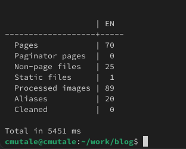
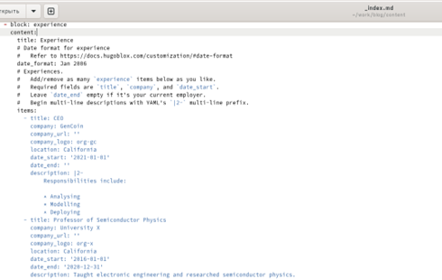
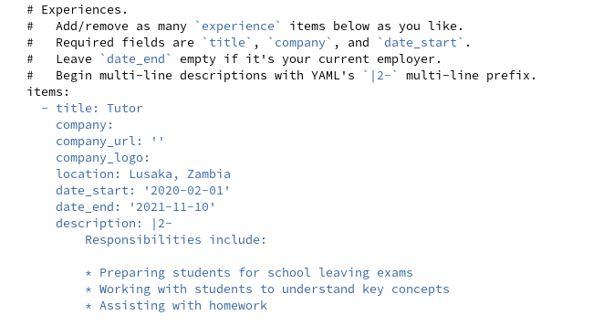
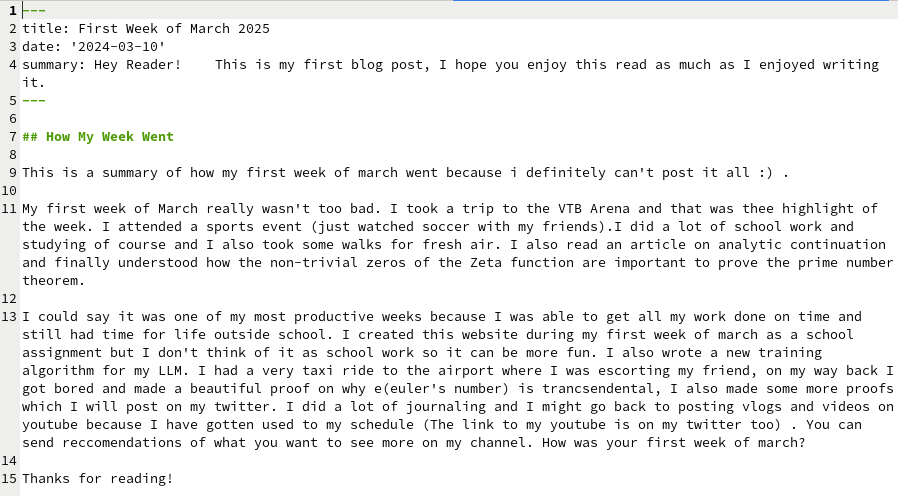
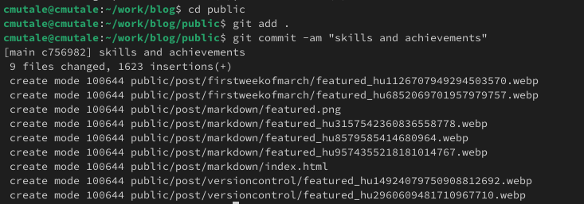

---
## Front matter
title: "Отчёт о выполнении третьего этапа индивидуального проекта"
subtitle: "Добавление достижения к сайту"
author: "Мутале Чали"

## Generic otions
lang: ru-RU
toc-title: "Содержание"

## Bibliography
bibliography: bib/cite.bib
csl: pandoc/csl/gost-r-7-0-5-2008-numeric.csl

## Pdf output format
toc: true # Table of contents
toc-depth: 2
lof: true # List of figures
lot: true # List of tables
fontsize: 12pt
linestretch: 1.5
papersize: a4
documentclass: scrreprt
## I18n polyglossia
polyglossia-lang:
  name: russian
  options:
	- spelling=modern
	- babelshorthands=true
polyglossia-otherlangs:
  name: english
## I18n babel
babel-lang: russian
babel-otherlangs: english
## Fonts
mainfont: PT Serif
romanfont: PT Serif
sansfont: PT Sans
monofont: PT Mono
mainfontoptions: Ligatures=TeX
romanfontoptions: Ligatures=TeX
sansfontoptions: Ligatures=TeX,Scale=MatchLowercase
monofontoptions: Scale=MatchLowercase,Scale=0.9
## Biblatex
biblatex: true
biblio-style: "gost-numeric"
biblatexoptions:
  - parentracker=true
  - backend=biber
  - hyperref=auto
  - language=auto
  - autolang=other*
  - citestyle=gost-numeric
## Pandoc-crossref LaTeX customization
figureTitle: "Рис."
tableTitle: "Таблица"
listingTitle: "Листинг"
lofTitle: "Список иллюстраций"
lotTitle: "Список таблиц"
lolTitle: "Листинги"
## Misc options
indent: true
header-includes:
  - \usepackage{indentfirst}
  - \usepackage{float} # keep figures where there are in the text
  - \floatplacement{figure}{H} # keep figures where there are in the text
---

# Цель работы

Цель данной работы является добавлением к сайту достижения.

# Задание
1. Список достижения:
  1. Добавить информацию о навыках
  2. Добавить информацию об опыте
  3. Добавить информацию о достижениях
2. Сделать пост по прошедщей неделе
3. Сделать пост на тему по выбору

# Выполнение лабораторной работы

## Список достижения

Сначала я создала локальный сервер, чтобы следить за страницей во время редактирования с помощью команды hugo server:

{#fig:001 width=70%}

### Добавить информацию о навыках

Далее я перешёл в какталог ~/work/blog/content/authors/admin и редактировала файл _index.md:

{#fig:002 width=70%}

Я добавил технические навыки и хобби:

{#fig:003 width=70%}

{#fig:004 width=70%}

На локальном сервере я проверил изменении:

{#fig:005 width=70%}

### Добавить информацию об опыте

Чтобы добавить информацию об опыте, я перешёл в ~/work/blog/content и открыла файл _index.md для редактировния:

{#fig:006 width=70%}

Я заменил существующую информфцию на свою собственную: 

{#fig:007 width=70%}

На локальном сервере я проверил изменении:

{#fig:008 width=70%}

### Добавить информацию о достижениях

В том же файле, где я добавил информацию об опыте, я заменяю информацию о достижениях на свою:

{#fig:009 width=70%}

{#fig:0010 width=70%}

# Пост по прошедщей неделе

Я создал папку lastweekofMarch и в ней вставил фотографию и файл index.md:

{#fig:0011 width=70%}

Затем я редактировал файл index.md:

{#fig:0012 width=70%}

# Пост на тему по выбору

Я создал папку Markdown и в ней вставил фотографию и файл markdown.md:

{#fig:0013 width=70%}

Затем я редактировал файл markdown.md:

{#fig:0014 width=70%}

На локальном сервере я проверил изменении:

{#fig:0015 width=70%}

Я перенес все изменения в репозиторий блога моего github:

{#fig:0016 width=70%}

Я перешёл в каталог public и перенес все изменения в репозиторий сайта моего github:

{#fig:0017 width=70%}

# Выводы

При выполнении данной работы я освоила размещение информацию на сайт.

# Список литературы{.unnumbered}

[Font awesome icons](https://fontawesome.ru/all-icons/)
