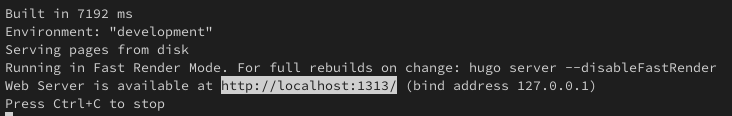
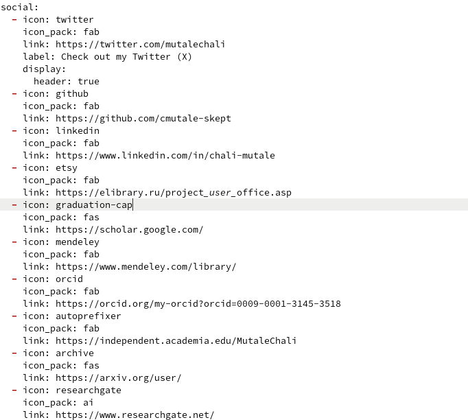
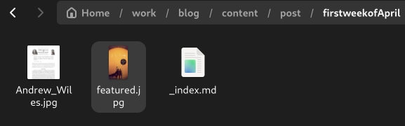
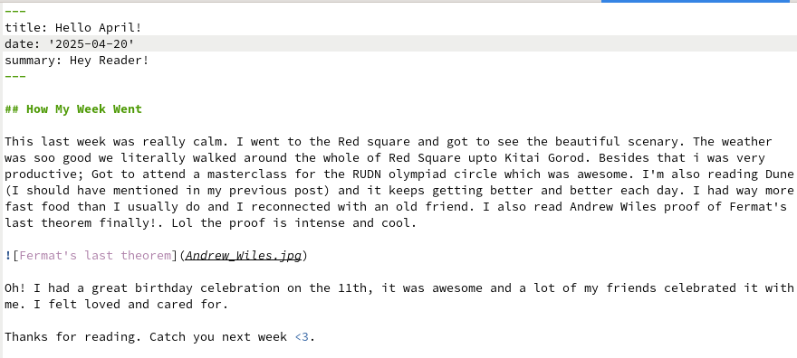
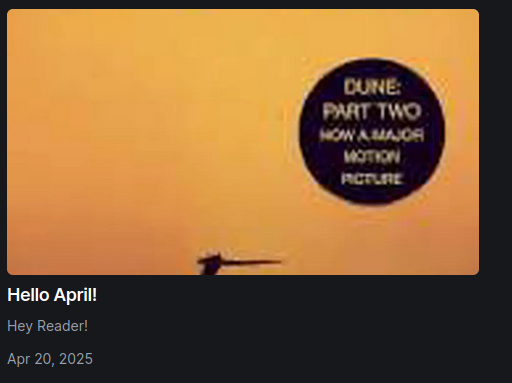
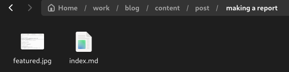
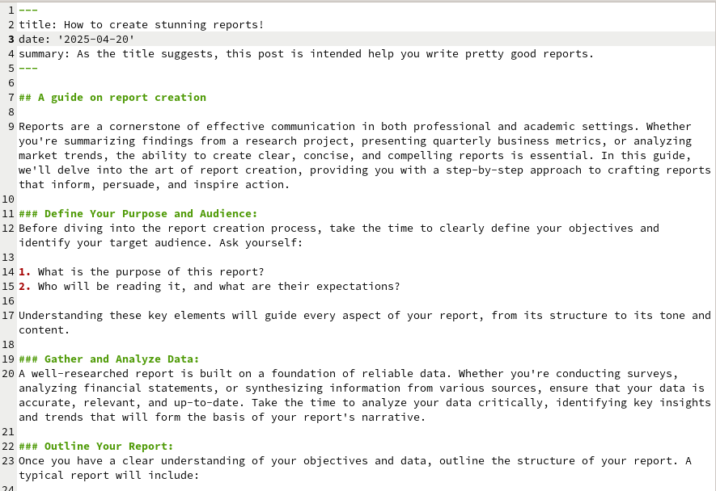
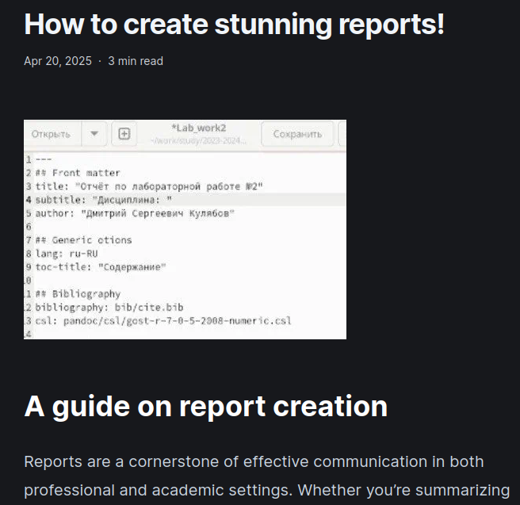

---
## Front matter
title: "Отчёт по четвертому этапу проекта"
subtitle: "Добавление к сайту ссылок на научные и библиометрические ресурсы"
author: "Мутале Чали"

## Generic otions
lang: ru-RU
toc-title: "Содержание"

## Bibliography
bibliography: bib/cite.bib
csl: pandoc/csl/gost-r-7-0-5-2008-numeric.csl

## Pdf output format
toc: true # Table of contents
toc-depth: 2
lof: true # List of figures
lot: true # List of tables
fontsize: 12pt
linestretch: 1.5
papersize: a4
documentclass: scrreprt
## I18n polyglossia
polyglossia-lang:
  name: russian
  options:
	- spelling=modern
	- babelshorthands=true
polyglossia-otherlangs:
  name: english
## I18n babel
babel-lang: russian
babel-otherlangs: english
## Fonts
mainfont: PT Serif
romanfont: PT Serif
sansfont: PT Sans
monofont: PT Mono
mainfontoptions: Ligatures=TeX
romanfontoptions: Ligatures=TeX
sansfontoptions: Ligatures=TeX,Scale=MatchLowercase
monofontoptions: Scale=MatchLowercase,Scale=0.9
## Biblatex
biblatex: true
biblio-style: "gost-numeric"
biblatexoptions:
  - parentracker=true
  - backend=biber
  - hyperref=auto
  - language=auto
  - autolang=other*
  - citestyle=gost-numeric
## Pandoc-crossref LaTeX customization
figureTitle: "Рис."
tableTitle: "Таблица"
listingTitle: "Листинг"
lofTitle: "Список иллюстраций"
lotTitle: "Список таблиц"
lolTitle: "Листинги"
## Misc options
indent: true
header-includes:
  - \usepackage{indentfirst}
  - \usepackage{float} # keep figures where there are in the text
  - \floatplacement{figure}{H} # keep figures where there are in the text
---

# Цель работы

Добавить к сайту ссылки на научные и библиометрические ресурсы.

# Задание

1. Разместить ссылки на научные и библиометрические ресурсы
2. Сделать пост по прошедшей неделе
3. Добавить пост по оформлению отчета

# Выполнение работы

## Разместить ссылки на научные и библиометрические ресурсы

Как всегда, я сначала создал локальный сервер с помощью ~/bin/hugo server:

{#fig:001 width=70%}

Далее я перешёл в каталог ~/work/blog/content/admin и редактировал файл _index.md (добавил ссылки):

{#fig:002 width=70%}

После этого я проверил выполнение работы на локальном сервере: 

{#fig:003 width=70%}

## Сделать пост по прошедшей неделе

Для того чтобы добавить к сайту пост по прошедшей неделе, я создал каталог /firstweekofApril, вставил в нем win.jpg и featured.jpg и создал index.md:

{#fig:004 width=70%}

Я написал некоторый текст в index.md который, как предполагается, является содержимым по вышеупомянутой теме:

{#fig:005 width=70%}

После этого я проверил выполнение работы на локальном сервере:

{#fig:006 width=70%}

## Добавить пост по оформлению отчета

Создал ещё один каталог с файлом index.md и изображением:

{#fig:007 width=70%}

Я написал некоторый текст в index.md и сохранил файл:

{#fig:008 width=70%}

проверил выполнение работы на локальном сервере:

{#fig:009 width=70%}

Затем я перенес все изменений на в репозитории на github, чтобы изменения внести на общедоступном сайте.

# Выводы

При выполнении данной работы я освоил дабавление ссылок на сайт, созданный с помощью hugo
