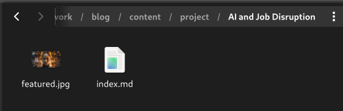
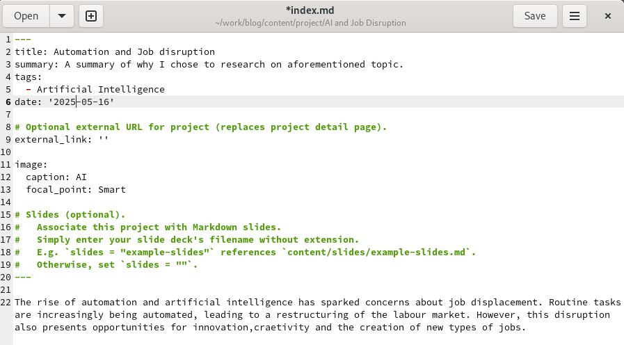
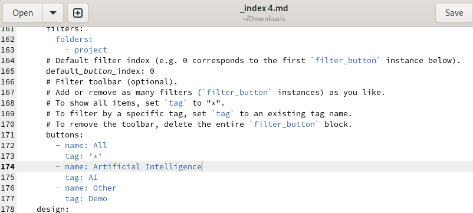
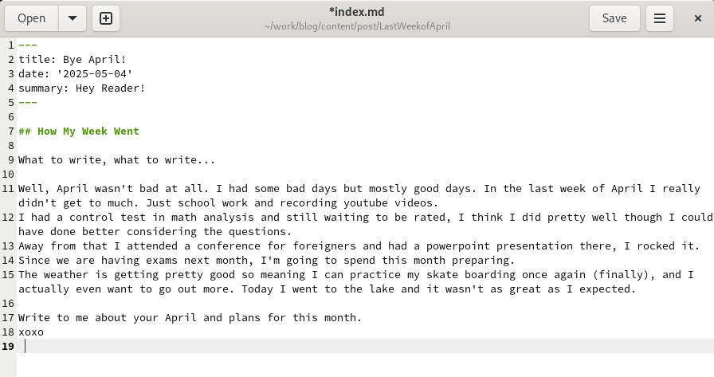
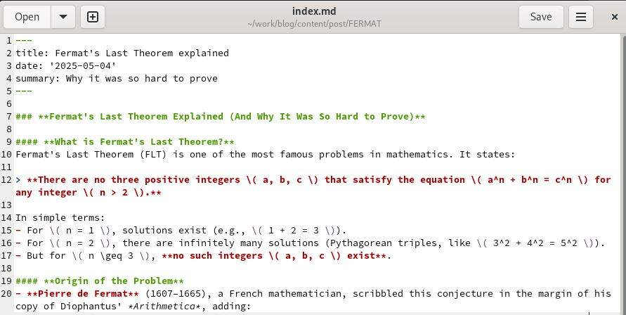
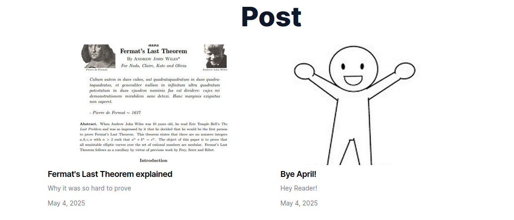
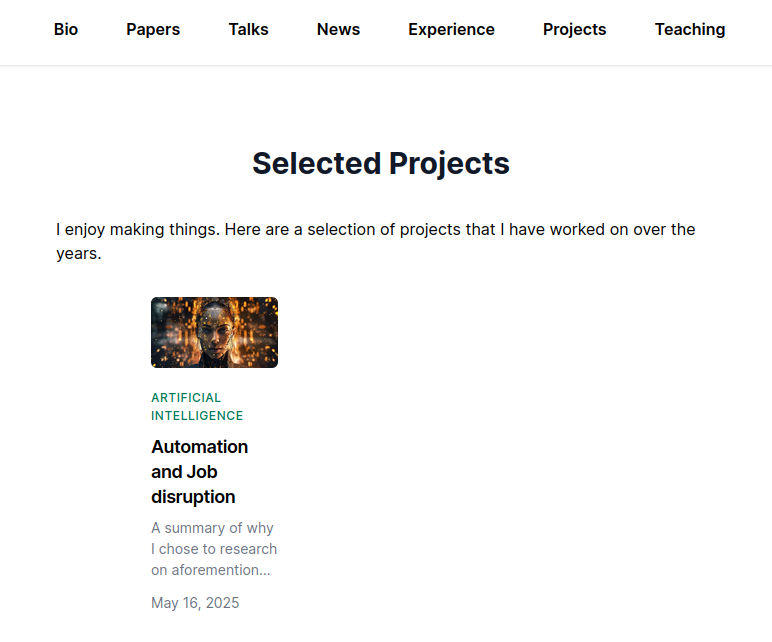

---
## Front matter
title: "Отчёт по индивидуальному проекту"
subtitle: "Пятый этап"
author: "Мутале Чали"

## Generic otions
lang: ru-RU
toc-title: "Содержание"

## Bibliography
bibliography: bib/cite.bib
csl: pandoc/csl/gost-r-7-0-5-2008-numeric.csl

## Pdf output format
toc: true # Table of contents
toc-depth: 2
lof: true # List of figures
lot: true # List of tables
fontsize: 12pt
linestretch: 1.5
papersize: a4
documentclass: scrreprt
## I18n polyglossia
polyglossia-lang:
  name: russian
  options:
	- spelling=modern
	- babelshorthands=true
polyglossia-otherlangs:
  name: english
## I18n babel
babel-lang: russian
babel-otherlangs: english
## Fonts
mainfont: PT Serif
romanfont: PT Serif
sansfont: PT Sans
monofont: PT Mono
mainfontoptions: Ligatures=TeX
romanfontoptions: Ligatures=TeX
sansfontoptions: Ligatures=TeX,Scale=MatchLowercase
monofontoptions: Scale=MatchLowercase,Scale=0.9
## Biblatex
biblatex: true
biblio-style: "gost-numeric"
biblatexoptions:
  - parentracker=true
  - backend=biber
  - hyperref=auto
  - language=auto
  - autolang=other*
  - citestyle=gost-numeric
## Pandoc-crossref LaTeX customization
figureTitle: "Рис."
tableTitle: "Таблица"
listingTitle: "Листинг"
lofTitle: "Список иллюстраций"
lotTitle: "Список таблиц"
lolTitle: "Листинги"
## Misc options
indent: true
header-includes:
  - \usepackage{indentfirst}
  - \usepackage{float} # keep figures where there are in the text
  - \floatplacement{figure}{H} # keep figures where there are in the text
---

# Цель работы

Отредактировать сайт.

# Задание

1. Добавить проект
2. Добавить пост по прошедшей неделе
3. Добавить пост на тему по выбору

# Выполнение лабораторной работы

## Добавить проект

Сначала я создал локальный сервер ,как обычно. Я перешёл в каталог ~/blog/content/project и создал каталог AI: 

{#fig:001 width=70%}

Далее перешёл в этом каталоге вставил фотографию featured.png и создал index.md. Написал некоторый текст в этом файле и сохранил изменения:

{#fig:002 width=70%}

В ~/blog/content редактировал файл index.md ,чтобы изменить Deep learning на Artificial intelligence:

{#fig:003 width=70%}

## Добавить пост по прошедшей неделе

Перешёл в ~/blog/content/post и создал новый каталог. В нем вставил фотографию featured.png и создал index.md. В написал о неделе и сохранил изменения:

{#fig:004 width=70%}

## Добавить пост на тему по выбору

Создал еще один новый каталог и в нем  контент о математическом доказательстве последней теоремы Ферма FERMAT:

{#fig:005 width=70%}

Далее сохранил изменения и проеверил все на локальном сервере. После этого я перенес все изменения в репозиторий на гит:

{#fig:006 width=70%}

{#fig:007 width=70%}

# Выводы

При выполнении данной работы я отредактировал сайт.
